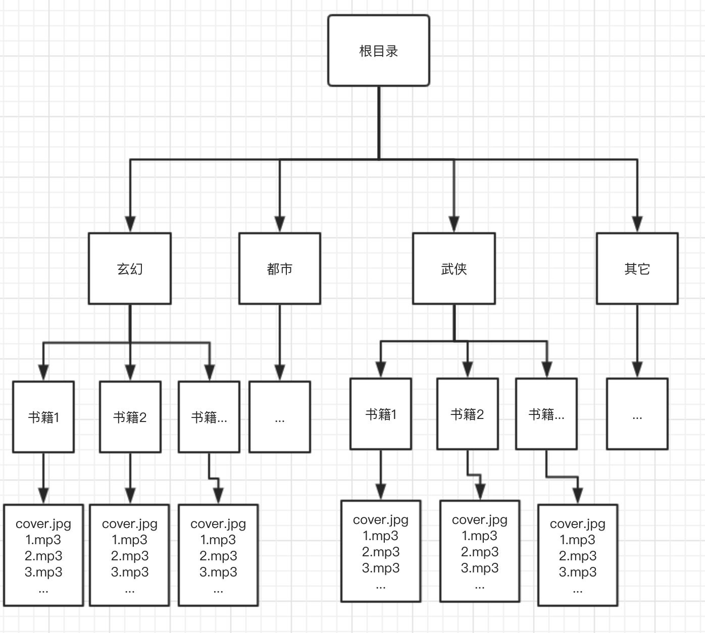

# 本地书库

本地书库要求目录要分三级，一级根目录，二级分类目录，最下面一级才是书籍目录。
如图所示：

## 作者和播音

作者和播音信息在书籍目录名后面加上，格式为: 书籍名_作者_播音

**举例:**
书名：全职高手
作者：蝴蝶蓝
播音：刺儿

目录名则为: 全职高手_蝴蝶蓝_刺儿

## 封面

在书籍目录里扔一个 `cover.jpg` 的图片，后缀名不局限于jpg，png 也可以。

## 选择本地书库目录

点击设置 -> 选择本地书库目录 -> 找到前面本地书库根目录
若显示的目录为空，可点击右上角`显示内部存储空间`。

## 实际效果

